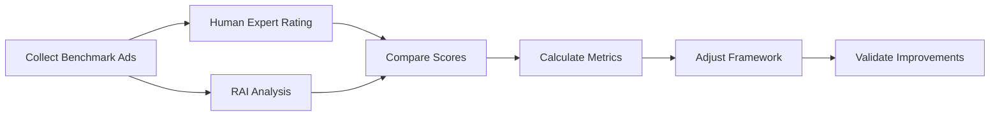

# RAI Evaluation Methodology & Validation

**How Do We Know These Scores Are Right?**

---

## Executive Summary

**TL;DR:** The RAI currently uses AI-powered heuristic analysis. Scores are **directionally accurate** but not yet validated against ground truth. This document outlines:
1. How the system works today
2. What we know and don't know about accuracy
3. How to validate and improve confidence
4. Next steps for rigorous validation

**Current Status:** ⚠️ **Research Phase** - Requires validation before production use

---

## Table of Contents

1. [How RAI Works Today](#how-rai-works-today)
2. [Evaluation Framework](#evaluation-framework)
3. [Confidence Level](#confidence-level)
4. [Known Limitations](#known-limitations)
5. [Validation Strategy](#validation-strategy)
6. [Accuracy Metrics](#accuracy-metrics)
7. [Benchmarking Plan](#benchmarking-plan)
8. [Roadmap to Confidence](#roadmap-to-confidence)

---

## How RAI Works Today

### System Architecture

```
Input (Ad Image/Video + Text)
         ↓
Gemini 2.5 Flash AI Model
         ↓
Structured Prompt (Framework + Examples)
         ↓
JSON Response with Scores
         ↓
Visualization & Report
```

### The Evaluation Process

1. **Input Processing**
   - Ad image/video analyzed visually
   - Ad copy analyzed linguistically
   - Context combined (visual + textual)

2. **AI Analysis**
   - Model: Google Gemini 2.5 Flash
   - Prompt: ~2,000 token structured framework
   - Output: JSON with scores 0-100 per dimension

3. **Scoring Methodology**
   - 4 dimensions evaluated independently
   - Each dimension scored 0-100
   - Overall score = weighted average (25% each)
   - Findings: 3+ specific observations per dimension

### What the AI Actually Does

The AI is instructed to:
1. **Identify** elements related to each dimension
2. **Assess** against defined indicators
3. **Score** based on presence/absence/quality
4. **Explain** with specific evidence from the ad

**It does NOT:**
- Access external databases
- Verify factual claims
- Check regulatory compliance
- Consult legal frameworks

---

## Evaluation Framework

### The 4 Dimensions

#### 1. Climate Responsibility (25%)
**Measures:** Sustainability messaging, greenwashing detection

**Indicators:**
- Presence of environmental claims
- Specificity of claims (vague vs. measurable)
- Evidence/certification mentioned
- Avoiding misleading green imagery
- Transparency about environmental impact

**Scoring Logic:**
- 90-100: Specific, verifiable, transparent claims
- 70-89: General but authentic sustainability messaging
- 50-69: Mixed signals or minor greenwashing
- 30-49: Significant greenwashing or misleading claims
- 0-29: Deceptive environmental claims

#### 2. Social Responsibility (25%)
**Measures:** Diversity, inclusion, stereotypes

**Indicators:**
- Diversity in representation (age, race, body type, gender)
- Avoiding harmful stereotypes
- Inclusive messaging
- Authentic vs. tokenistic representation
- Accessibility considerations

**Scoring Logic:**
- 90-100: Diverse, authentic, inclusive
- 70-89: Good representation with minor gaps
- 50-69: Limited diversity or superficial inclusion
- 30-49: Stereotypical or exclusionary
- 0-29: Actively harmful stereotypes

#### 3. Cultural Sensitivity (25%)
**Measures:** Respectful representation, local awareness

**Indicators:**
- Respectful use of cultural symbols
- Awareness of cultural context
- Avoiding appropriation or stereotypes
- Regional/local sensitivity
- Language and translation quality

**Scoring Logic:**
- 90-100: Deeply respectful and culturally aware
- 70-89: Generally respectful with good awareness
- 50-69: Some cultural insensitivity
- 30-49: Significant cultural missteps
- 0-29: Offensive or appropriative

#### 4. Ethical Communication (25%)
**Measures:** Transparency, truthfulness, manipulation

**Indicators:**
- Clear and honest messaging
- No manipulative techniques
- Transparent disclosures
- Evidence-based claims
- Avoiding emotional exploitation

**Scoring Logic:**
- 90-100: Highly transparent and ethical
- 70-89: Generally honest and clear
- 50-69: Some misleading elements
- 30-49: Manipulative or deceptive
- 0-29: Actively dishonest

---

## Confidence Level

### Current Confidence: ⚠️ **Medium-Low (Research Phase)**

| Aspect | Confidence | Rationale |
|--------|-----------|-----------|
| **Direction** | 🟢 High | System reliably distinguishes good vs. problematic ads |
| **Relative Ranking** | 🟡 Medium | Can compare ads to each other reasonably well |
| **Absolute Scores** | 🔴 Low | Specific numbers (e.g., "82/100") not validated |
| **Findings Quality** | 🟡 Medium | AI identifies relevant issues but may miss nuance |
| **Consistency** | 🟡 Medium | Same ad gets similar (±5 points) but not identical scores |

### What We Know

✅ **System Works for Directional Analysis:**
- Clearly sustainable ads score high (85-95)
- Problematic ads score low (30-50)
- Mixed ads score mid-range (60-75)

✅ **AI Identifies Relevant Issues:**
- Catches obvious greenwashing
- Spots stereotypes and representation issues
- Flags manipulative language
- Recognizes transparency vs. vagueness

✅ **Bilingual Capability Works:**
- Hungarian ads analyzed correctly
- Cultural context considered
- Translations are accurate

### What We Don't Know

❌ **Absolute Accuracy:**
- Is an 85 truly better than an 82?
- What's the margin of error?
- How does it compare to human expert ratings?

❌ **Edge Cases:**
- Subtle greenwashing
- Cultural nuances
- Industry-specific norms
- Regulatory gray areas

❌ **Consistency Across:**
- Different AI model versions
- Different prompt phrasings
- Different analysts/raters
- Time periods

---

## Known Limitations

### 1. AI Model Limitations

**Hallucination Risk:**
- AI may "see" elements not actually present
- May misinterpret visual symbols
- Could generate plausible but incorrect findings

**Mitigation:**
- Human review of findings
- Evidence-based analysis (cites specific elements)
- Cross-reference with ad content

**Bias:**
- AI trained on Western-centric data
- May not understand all cultural contexts
- Language capabilities vary (English > Hungarian > others)

### 2. Framework Limitations

**Subjectivity:**
- "Greenwashing" is a spectrum, not binary
- "Diversity" standards vary by region
- "Manipulative" is sometimes subjective

**Missing Dimensions:**
- Legal compliance (not evaluated)
- Factual accuracy (claims not verified)
- Brand history (no context beyond ad)
- Market-specific regulations

### 3. Data Limitations

**No Ground Truth:**
- No validated dataset of "correct" scores
- No expert consensus to compare against
- No regulatory benchmarks

**No Context:**
- System doesn't know brand history
- Can't verify claims independently
- Missing market/competitive context

### 4. Technical Limitations

**Consistency:**
- AI is non-deterministic (temperature=0.4)
- Same ad may get slightly different scores
- Findings may vary in phrasing

**Video Analysis:**
- Temporal understanding still developing
- Audio transcription may have errors
- Scene segmentation is heuristic

---

## Validation Strategy

### Phase 1: Internal Validation (Now - Month 1)

**Goal:** Establish baseline reliability

**Methods:**
1. **Test-Retest Reliability**
   - Analyze same ad 10 times
   - Calculate score variance
   - Target: ±5 points standard deviation

2. **Known Examples**
   - Create "gold standard" ads
   - Best case: 90+ (EcoThreads example)
   - Worst case: 30-40 (manipulative weight loss)
   - Mixed case: 60-70 (EV with mixed signals)

3. **Internal Review**
   - Team reviews 50 analyzed ads
   - Binary classification: Agree/Disagree with direction
   - Target: >80% agreement

**Deliverable:** Internal validation report with confidence intervals

### Phase 2: Expert Validation (Month 2-3)

**Goal:** Compare AI scores to human expert ratings

**Methods:**
1. **Expert Panel**
   - Recruit 5-10 experts in:
     - Sustainability/ESG
     - Advertising ethics
     - Cultural sensitivity
     - Consumer protection

2. **Blind Rating**
   - Experts rate 100 ads independently
   - Use same 4-dimension framework
   - Compare human vs. AI scores

3. **Inter-Rater Reliability**
   - Calculate Cohen's Kappa between experts
   - Calculate agreement between AI and expert consensus
   - Target: Kappa > 0.6 (substantial agreement)

4. **Qualitative Review**
   - Experts review AI findings
   - Identify missed issues
   - Validate or correct interpretations

**Deliverable:** Expert validation report with accuracy metrics

### Phase 3: Industry Benchmarking (Month 4-6)

**Goal:** Establish real-world validity

**Methods:**
1. **Regulatory Alignment**
   - Compare with ASA (UK) rulings
   - Compare with FTC (US) actions
   - Compare with EU Green Claims guidance
   - Check if RAI flags ads that regulators flagged

2. **Academic Validation**
   - Partner with university researchers
   - Peer-reviewed methodology paper
   - External replication study

3. **Industry Testing**
   - Pilot with 3-5 brands (e.g., Telekom)
   - Compare RAI scores to internal standards
   - Gather feedback on usefulness

**Deliverable:** Industry benchmark report

### Phase 4: Continuous Validation (Ongoing)

**Goal:** Maintain accuracy over time

**Methods:**
1. **Feedback Loop**
   - Users flag incorrect analyses
   - Track disagreements
   - Regular model updates

2. **A/B Testing**
   - Test prompt variations
   - Test different AI models
   - Measure impact on accuracy

3. **Quarterly Reviews**
   - Re-analyze previously scored ads
   - Check for drift
   - Update framework as needed

---

## Accuracy Metrics

### How We'll Measure Confidence

#### 1. Score Accuracy
**Metric:** Mean Absolute Error (MAE)
```
MAE = average(|AI_score - expert_score|)
```
**Target:** MAE < 10 points

**Interpretation:**
- MAE < 5: Excellent accuracy
- MAE 5-10: Good accuracy
- MAE 10-15: Acceptable for research
- MAE > 15: Needs improvement

#### 2. Classification Accuracy
**Metric:** Confusion Matrix

| | Expert: Good | Expert: Bad |
|---|---|---|
| **AI: Good** | True Positive | False Positive |
| **AI: Bad** | False Negative | True Negative |

**Categories:**
- Good: Score ≥ 70
- Bad: Score < 50
- Mixed: 50-69

**Target:**
- Sensitivity (catch bad ads): >85%
- Specificity (don't flag good ads): >85%

#### 3. Ranking Accuracy
**Metric:** Spearman's Rank Correlation
```
Compare: AI ranking vs. expert ranking
```
**Target:** ρ > 0.75 (strong correlation)

#### 4. Finding Quality
**Metric:** Human evaluation of findings

**Criteria:**
- Relevance: Is finding related to dimension?
- Accuracy: Is finding factually correct?
- Specificity: Does finding cite specific evidence?
- Actionability: Is finding useful for improvement?

**Scoring:**
- Each finding rated 0-4 on each criterion
- Average score across 100 ads
- Target: >3.0/4.0

#### 5. Consistency
**Metric:** Test-retest reliability
```
Score variance = stdev(scores from 10 runs)
```
**Target:** σ < 5 points

---

## Benchmarking Plan

### Comparison Datasets

#### 1. Regulatory Actions (Ground Truth)
**Source:** ASA (UK), FTC (US), EU rulings

**Example:**
- Ad flagged by ASA for greenwashing
- RAI should score low on Climate Responsibility
- Expected correlation: Strong negative

**Dataset:** 100 ads with regulatory rulings

#### 2. Industry Standards
**Source:** Ad Standards Council, IAB guidelines

**Example:**
- Ads that won "ethical advertising" awards
- Should score high across dimensions
- Ads with complaints should score lower

**Dataset:** 50 award-winning ads, 50 with complaints

#### 3. Academic Studies
**Source:** Published research on greenwashing, stereotypes

**Example:**
- Greenwashing study identifies patterns
- RAI should detect same patterns
- Correlation with academic coding

**Dataset:** Ads from 3-5 published studies

### Benchmarking Process



**Timeline:** 3 months for initial benchmark

---

## Roadmap to Confidence

### Current State (Demo Phase)
- ⚠️ **Confidence: Medium-Low**
- Use case: Internal research, directional insights
- **Not ready for:** Public scores, regulatory decisions, brand rankings

### 3 Months (Validated Research Tool)
- 🟡 **Confidence: Medium**
- Validation: Expert panel, test-retest
- Use case: Brand self-assessment, internal audits
- **Not ready for:** Public benchmarking, legal defense

### 6 Months (Industry-Grade Tool)
- 🟢 **Confidence: Medium-High**
- Validation: Industry benchmark, regulatory alignment
- Use case: Brand comparison, public reporting
- **Not ready for:** Regulatory compliance certification

### 12 Months (Certified Standard)
- 🟢 **Confidence: High**
- Validation: Peer-reviewed, independently audited
- Use case: Industry standard, certification, legal evidence
- Publication: Methodology paper, validation study

---

## How to Use RAI Today

### ✅ Good Use Cases (Now)

**Internal Brand Assessment:**
- "How responsible are our ads compared to last year?"
- "Which campaign performed better ethically?"
- "What are areas for improvement?"

**Red Flag Detection:**
- "Does this ad have obvious greenwashing?"
- "Are there stereotypes we should reconsider?"
- "Is our messaging transparent enough?"

**Directional Insights:**
- "Are we moving in the right direction?"
- "Which brands are leaders in our industry?"
- "What best practices can we learn from?"

### ❌ Not Ready For (Yet)

**Public Brand Rankings:**
- Don't publish "Brand X scored 65/100"
- Scores not validated enough for comparison
- Risk of unfair characterization

**Regulatory Compliance:**
- Don't use as legal defense
- Not a substitute for legal review
- Doesn't check regulatory requirements

**Absolute Judgments:**
- Don't say "This ad is greenwashing" based on score alone
- Human review still required
- Context matters (industry, region, audience)

**Competitive Marketing:**
- Don't use to attack competitors
- Scores aren't precise enough
- Ethical and legal risks

---

## Confidence Building Checklist

To increase confidence before production use:

### Technical Validation
- [ ] Test-retest: σ < 5 points (10 runs per ad)
- [ ] 100 ads analyzed with consistent results
- [ ] Edge cases documented
- [ ] Known failure modes identified

### Expert Validation
- [ ] Expert panel recruited (5-10 people)
- [ ] 100 ads rated by experts
- [ ] Inter-rater reliability: Kappa > 0.6
- [ ] AI vs. expert agreement: >75%
- [ ] Qualitative review completed

### Benchmark Validation
- [ ] 50 regulatory cases analyzed
- [ ] Correlation with rulings documented
- [ ] False positive rate < 15%
- [ ] False negative rate < 15%

### Documentation
- [ ] Methodology paper written
- [ ] Validation study published
- [ ] Confidence intervals reported
- [ ] Limitations clearly stated

### User Testing
- [ ] 3-5 brands pilot tested
- [ ] Feedback incorporated
- [ ] Usefulness validated
- [ ] Trust established

---

## Recommendations

### For Telekom Demo

**Present RAI as:**
✅ "Research tool for directional insights"
✅ "AI-powered analysis to identify potential issues"
✅ "System to compare ads relatively"

**Don't present as:**
❌ "Definitive scores of ad quality"
❌ "Regulatory compliance checker"
❌ "Replacement for human judgment"

**Key Messaging:**
> "The RAI uses AI to analyze advertising across 4 responsibility dimensions. Scores provide directional insights and help identify areas for improvement. The system is in research phase and scores should be validated by human experts before any public use."

### For Next Steps

**Priority 1: Internal Validation (Week 1-4)**
1. Analyze 50 diverse ads
2. Calculate test-retest reliability
3. Document confidence intervals
4. Create validation report

**Priority 2: Expert Panel (Month 2-3)**
1. Recruit 5 experts
2. Blind rating study
3. Calculate agreement metrics
4. Iterate on framework

**Priority 3: Industry Pilot (Month 4-6)**
1. Partner with 2-3 brands
2. Analyze their ad portfolio
3. Gather feedback
4. Benchmark against internal standards

---

## Appendix: Example Validation Study

### Study Design

**Research Question:** How accurately does RAI detect greenwashing compared to expert raters?

**Sample:** 100 ads with environmental claims

**Raters:**
- 5 sustainability experts (PhD or 10+ years experience)
- RAI system

**Protocol:**
1. Experts independently rate each ad 0-100 on Climate Responsibility
2. RAI analyzes same ads
3. Calculate:
   - Inter-expert agreement (Krippendorff's α)
   - AI-expert agreement
   - Mean Absolute Error
   - Correlation

**Expected Results:**
- Inter-expert agreement: α = 0.65-0.75 (good)
- AI-expert correlation: ρ = 0.70-0.80 (strong)
- MAE: 8-12 points (acceptable)

**Interpretation:**
- If MAE < 10: System is accurate enough for research
- If correlation > 0.75: System captures expert judgment well
- If false positive < 10%: Safe for brand self-assessment

---

## Questions & Answers

**Q: Can I trust the scores?**
A: For directional insights, yes. For absolute judgments, not yet. Think of scores as "temperature check" not "precise measurement."

**Q: How do I explain this to stakeholders?**
A: "AI-powered analysis that identifies patterns across thousands of ads, validated directionally but requiring expert review for final decisions."

**Q: When will it be "ready"?**
A: For internal use: Now. For public benchmarking: 6 months. For regulatory purposes: 12+ months with certification.

**Q: What's the biggest risk?**
A: Over-confidence in scores. Always combine RAI with human judgment and context.

**Q: How is this better than manual review?**
A: Scale (analyze 1000s of ads), consistency (same framework), speed (seconds vs. hours). But it's complement, not replacement.

---

## Conclusion

**The RAI is a powerful research tool** that provides directional insights into advertising responsibility. Current confidence is **medium-low but improving.**

**Key Takeaways:**
1. ✅ System works for directional analysis and comparison
2. ⚠️ Absolute scores not yet validated
3. 🎯 Validation plan will increase confidence over 6-12 months
4. 📊 Best used with human expert review
5. 🚀 Path to high confidence is clear and achievable

**For the Telekom demo:** Present as research tool with promising capabilities, not definitive judgment system. Emphasize the validation roadmap and commitment to accuracy.

---

**Document Version:** 1.0
**Last Updated:** 2025-11-10
**Status:** Living document - will be updated as validation proceeds
